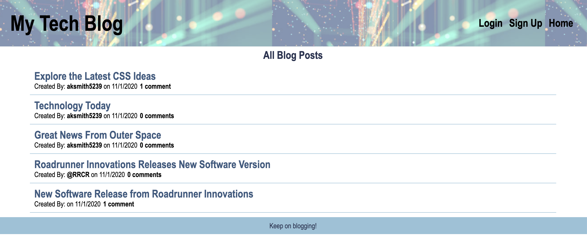

# My Tech Blog

## Description
My Tech Blog is an interactive web based blog site. When the user accesses the site a list of blog posts appears on the home page. The user may sign up or login. Once logged in the user may view the posts, comment on the posts or enter new posts. The user may also edit or delete their own posts.

***
## Table of Contents
[Installation](#installation) 
[Usage](#usage) 
[Contributing](#contributing) 
[Tests](#tests) 
[License](#license) 
[Questions](#questions) 
***
## Installation
The site is deployed on Heroku at: https://my-tech-blog-2020.herokuapp.com/

## Usage
The application may be used to create and edit blog posts

## Contributing

## Tests

## License
### This license is covered under the  license(s):
* 
***
## Questions
For more information contact me at: 
* Name: aksmith5239
* GitHub: https://github.com/aksmith5239/tech-blog
* Email Address: aklobby@gmail.com
    